# Coaches Guide — Contoso Travel Concierge

> **Status:** Narrative draft. We are building the walkthrough with screenshots from a fresh run.

## Contents

1. [How we use this guide](#1-how-we-use-this-guide)
2. [The story we are telling](#2-the-story-we-are-telling)
3. [The Agent DevOps journey](#3-the-agent-devops-journey)
4. [How we document each lab](#4-how-we-document-each-lab)
5. [Walkthrough status](#5-walkthrough-status)
6. [Activate Copilot](#6-activate-copilot)
7. [Fundamentals walkthrough](#7-fundamentals-walkthrough)

Numbering runs `chapter.section` (for example, `6.1`). If a step is unclear, cite its number — for example, "stuck on 7.1 tips".

<div align="center">· · ·</div>

## 1. How we use this guide

This guide helps us explain the **what** and **why** behind each learner lab. The learner-facing instructions in [`labs/`](../) describe the actions. This guide adds the developer problem, the reason for each action, and the ideas we should notice along the way.

We write as trainers working alongside the learner. We use **we** and **our**, explain concepts before using them, and keep each step actionable. For every walkthrough step, we begin with the developer question that the step helps answer.

When the walkthrough and the learner labs differ, we mark the location with:

> 🔎 **Walkthrough note:** the observed path differs from the current learner instructions. We should verify which path is current and update the right source.

<div align="center">· · ·</div>

## 2. The story we are telling

We are building and improving the **Contoso Travel Concierge**, an AI travel assistant for the fictitious Contoso Travel agency. A traveler asks about flights, hotels, or car rentals. The agent uses its instructions, a selected model, and travel inventory data to decide what to ask, look up, and say. Its scope is deliberately narrow: it answers travel questions only and returns a relevant itinerary when the available data supports one.

The engineering problem is not simply making one answer look good. We need a repeatable way to build an agent, observe its behavior, measure whether it meets our requirements, improve it, and understand how it behaves after deployment.

### 2.1 Our travel data

The workshop uses three small JSON datasets. Each represents a source that the Concierge can search. CSV versions are also available in the repository, but JSON is the representation we use for the agent story and examples.

| Data source | What it contains | Example record |
|---|---|---|
| `data/json/flights.json` | Flight identifier, airline, route, dates, cabin, price, and available seats | `CT-FL-001`: Contoso Skyways, Seattle to Paris, Economy, `$750`, 42 seats |
| `data/json/hotels.json` | Hotel identifier, name, city, rating, nightly price, amenities, availability, and dates | `CT-HT-001`: Le Marais Grand Hotel, Paris, 5 stars, `$320/night`, WiFi, Pool, Spa, Restaurant, Gym |
| `data/json/car_rentals.json` | Rental identifier, company, city, vehicle type, daily price, availability, and dates | `CT-CR-001`: Contoso Wheels, Paris, Economy, `$45/day`, available |

The records are intentionally simple. That lets us focus on agent behavior: asking for missing details, using the right source, responding within scope, and producing answers we can evaluate.

### 2.2 The example journey we carry through the loop

We use one traveler journey as our running example:

1. The traveler asks for a business-class flight from Seattle to Paris under `$2,500`.
2. The agent identifies that travel dates are missing and asks for them before searching.
3. The traveler provides August 15 to August 30, 2027, and asks for a hotel and rental car in Paris as well.
4. The agent searches the three relevant JSON sources and assembles an itinerary from matching records, such as the business-class flight `CT-FL-002`, a Paris hotel, and an available Paris rental car.
5. The traveler asks an unrelated question. The agent declines because it is outside the travel-only scope.

This journey gives us simple, complex, and out-of-scope prompts to test. It also gives us observable behavior to trace and requirements to evaluate: collect required details, use the correct data source, match the constraints, assemble a useful itinerary, and stay within scope.

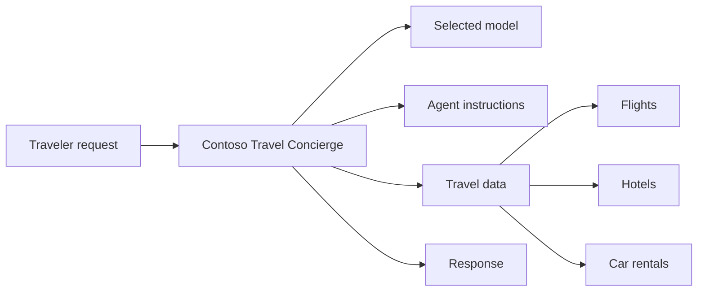
```mermaid
flowchart LR
    Traveler[Traveler request] --> Concierge[Contoso Travel Concierge]
    Concierge --> Model[Selected model]
    Concierge --> Instructions[Agent instructions]
    Concierge --> Sources[Travel data]
    Sources --> Flights[Flights]
    Sources --> Hotels[Hotels]
    Sources --> Cars[Car rentals]
    Concierge --> Answer[Response]
```

<div align="center">· · ·</div>

## 3. The Agent DevOps journey

We follow the same loop we would use for an agent in a real development project. We begin with a single prompt agent so that we can see each part of the loop clearly. Later, we apply the loop to focused skills, an optimization service, and a hosted multi-agent system.

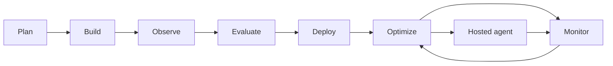
```mermaid
flowchart LR
    Plan[Plan] --> Build[Build]
    Build --> Observe[Observe]
    Observe --> Evaluate[Evaluate]
    Evaluate --> Deploy[Deploy]
    Deploy --> Optimize[Optimize]
    Optimize --> Monitor[Monitor]
    Monitor --> Optimize
    Optimize --> Hosted[Hosted agent]
    Hosted --> Monitor
```

### 3.1 Fundamentals: learn the loop

**Plan:**

- Answers: *What are we trying to build, and what will count as success?*
- We choose a model, define the agent instructions, identify the data, and prepare evaluation questions.

**Build:**

- Answers: *How do we turn that specification into a working agent?*
- We create the Foundry project, deploy the selected model, create the prompt agent, and configure its instructions and tools.

**Observe:**

- Answers: *What did the agent actually do?*
- We use the Agent Playground, Traces tab, and Evaluation tabs to understand responses and the work behind them.
- We learn what a trace, span, action, response, trajectory, and graph represent.
- We compare trace, responses, and conversation views, then trajectory, user, and graph views.

**Evaluate:**

- Answers: *Does the agent meet the requirements we wrote down?*
- We run the built-in evaluator and learn what default quality, safety, and performance metrics mean.
- We connect evaluation results back to the traces that produced them.

**Deploy:**

- Answers: *Which tested agent version are we making available?*
- We save the working prompt agent as a new version.

**Optimize:**

- Answers: *What is the smallest useful change we can make?*
- We run the inline prompt optimizer, save the resulting version, and run the evaluator again.

**Monitor:**

- Answers: *How is the deployed agent behaving over time?*
- We inspect the Agent monitoring tab, learn which metrics matter, use the Observability agent, and visit the Azure portal to view trace logs in Application Insights.

### 3.2 Core labs: climb one step at a time

The core labs turn optimization into a disciplined **hill-climbing** process. We use the `observe` sub-skill to drive one full pass of the loop, then repeat. Each pass moves one thing.

The hill-climbing cycle:

- Activate Copilot and use the `observe` sub-skill to guide the loop.
- Reuse cached suites, datasets, and evaluators under `.foundry/` when they are still valid; regenerate only when we must.
- Run a `tier=smoke` evaluation first for a fast signal, then wider `regression` or `coverage` suites when we need depth.
- Cluster failures, pick **one** gap, and define **one** climb target.
- Ask the `prompt_optimize` MCP tool for a suggestion, review the diff, and save a new agent version.
- Re-run the same evaluation and compare versions with `evaluation_comparison_create`.
- Keep a human in the loop on every apply-and-deploy decision.

We do this on the **prompt agent** by design. The prompt agent gives us the smallest number of moving parts (portal, one prompt, one model, one dataset) so the loop itself is the lesson. The `observe` loop, the built-in metrics, the rubric evaluator, and the version comparison all work the same way on a hosted agent — we're learning the pattern here so we can apply it at scale later.

### 3.3 Bonus: Agent Optimizer as a service

The Agent Optimizer applies hill climbing as a service. It runs an optimization job over an agent and returns multiple candidates that target **instructions**, **model**, **skill folder**, or **function-tool definitions**. We review each candidate, apply the one we choose locally, and redeploy — the tool never mutates the agent for us.

Two things to know up front:

- **Prerequisite: a Python hosted agent.** Agent Optimizer scaffolds `.agent_configs/baseline/`, adds `azure-ai-agentserver-optimization`, and runs through `azd ai agent optimize`. This is why we move from the prompt agent to a hosted agent before this section — and why the workshop's Capstone is a hosted agent.
- **The evaluation rubric is our measurement instrument.** A single-dimensional built-in metric can't compare Agent Optimizer candidates fairly. We author or auto-generate a multidimensional rubric evaluator through the `observe` sub-skill and use it as the yardstick for every candidate.

The rubric lifecycle stays the same across the whole workshop:

- **Initial:** create a rubric from the agent instructions (auto-generate with `evaluator_generation_job_create` or author with `evaluator_catalog_create`).
- **Baseline:** run the rubric evaluator against the current agent.
- **Improve:** use production traces to find missing or weak rubric criteria.
- **Iterate:** run the new rubric version against the next agent version.

We introduce the rubric during Evaluate, use it again in the Core labs, and treat it as a first-class task in the Capstone.

### 3.4 Why move from a prompt agent to a hosted agent?

We move to a hosted agent when the problem asks for more control than one prompt can provide:

- **Decomposition:** split the travel workflow across focused agents.
- **Fine-grained control:** control routing, state, retries, tools, and flow in code.
- **Framework choice:** use the Microsoft Agent Framework or another supported framework such as LangGraph.
- **Developer tools:** use skills, the Azure Developer CLI (`azd`), Foundry Toolkit, and normal code tooling.
- **Access to the Agent Optimizer service.** The Optimizer only works on Python hosted agents (§3.3).

The loop itself does not change. `observe`, the rubric evaluator, and version comparison all still apply — they just run through code and `azd` instead of the portal.

### 3.5 Capstone: apply the loop to a hosted system

The capstone uses the prompt-agent specification as the requirements for a hosted implementation. We use the Microsoft Agent Framework and build three focused agents, each with a specific tool and its own optimized instructions.

At a high level, the capstone tasks are:

- **Rebuild as a hosted system.** Convert the Concierge into three agents (flights, hotels, car rentals) plus a coordinator, using the Microsoft Agent Framework.
- **Re-run the observation and optimization loop on the core agent.** Same `observe` sub-skill, same hill-climbing discipline, now through `azd`.
- **Run Agent Optimizer on the core agent.** This is where §3.3 lands: candidates for instructions, model, skill folder, or tool definitions, evaluated against the rubric.
- **Design and run a custom rubric evaluator as an explicit task.** Derive rubric dimensions from the instructions, register it, ensure every dataset row carries an `expected_behavior`, and use `result` + `reason` as the fixed output contract.
- **Combined observe + agent-optimizer flow.** Baseline eval → agent-optimizer scaffold + job → review candidates → apply candidate → `azd deploy` → regression eval → `evaluation_comparison_create`.

The final questions are architectural:

- What changes if each agent uses a different model?
- What changes if we use a model router?
- What changes if we distill knowledge from a frontier model into a cheaper alternative?

The capstone closes the story: the most capable model is a starting point, not automatically the best design for every part of the system.

<div align="center">· · ·</div>

## 4. How we document each lab

For each lab and each walkthrough step, we use the same seven sub-parts:

- **Developer question** — what are we answering together? Rendered as a `> ❓ *...*` callout so it stands out at a glance.
- **What problem are we solving?** — the limitation, uncertainty, or engineering need.
- **How are we solving it?** — the Foundry feature, code path, or development practice, with concepts explained first.
- **Exercise: lab steps** — the learner steps we perform, linked to the relevant lab, with screenshots.
- **What did we learn?** — what changed in our understanding and in the agent or environment.
- **Extension** — a useful experiment for learners who want to go further.
- **Tips** — gotchas and recovery. Cross-cutting failures link to [`TROUBLESHOOTING.md`](../TROUBLESHOOTING.md); local differences use the `🔎 Walkthrough note` marker.

<div align="center">· · ·</div>

## 5. Walkthrough status

- Fundamentals: in progress
- Core: pending fundamentals screenshots and observations
- Bonus Agent Optimizer: pending core results
- Capstone hosted agent: pending the optimization story

<div align="center">· · ·</div>

## 6. Activate Copilot

We use **GitHub Copilot Chat inside Codespaces** as our development partner throughout the workshop. Later, we can drive the same conversations from the terminal with the GitHub Copilot CLI (`copilot`) — either works. We start with Chat because it renders diagrams, screenshots, and multi-file diffs inline, which helps while we are learning.

Copilot Chat also gives us access to **skills** — packaged domain knowledge that the model can call on. In this workshop, the **`microsoft-foundry` skills** are the ones that know Foundry projects, agents, evaluations, and monitoring. They are exposed through the Foundry Model Context Protocol (MCP) server. MCP is the protocol Copilot uses to reach external tools and skills.

### 6.1 Prerequisites

- The Codespace is running.
- The five tools from [§7.1](#71-verify-our-starting-point) are installed (the devcontainer already ships them).
- We are signed in to `az` and `azd`.

### 6.2 Turn on Copilot Chat

1. **Open Copilot Chat.** Use the Copilot icon in the VS Code activity bar, or the command palette (`Ctrl/Cmd+Shift+P` → *Chat: Focus on Chat View*).
2. **Say `Hi`** to activate Copilot. If prompted, sign in to the GitHub account that has Copilot access.
3. **Confirm Agent mode and model.** In the chat header, set the mode to *Agent* and the model to **Claude Sonnet 4.6** (this model works well for the walkthrough).
4. **Enable the Foundry MCP server** when prompted. Approve the connection and complete the Azure sign-in that appears — this authorizes Copilot to reach the `microsoft-foundry` skills.
5. **Relax tool permissions for the session.** Below the chat window, open *Default permissions* and switch to *Allow all*. This avoids repeated prompts while we run multi-step actions.

   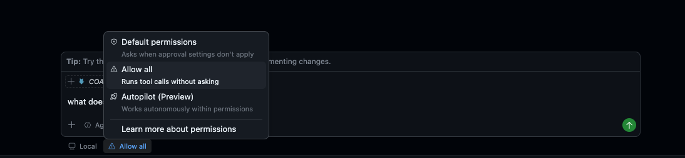

> ⚠️ *Allow all* applies to the current Codespace session. It speeds up the workshop but grants the agent broad tool access. Reset it when you leave the workshop if you re-use the Codespace for other work.

### 6.3 Verify the Foundry skills are reachable

Ask Copilot Chat:

```text
What do microsoft-foundry skills do?
```

Copilot should answer using the Foundry skill catalog (deploy agents, evaluate, monitor, and so on). If the answer is generic or Copilot says it cannot see the skills, the MCP server is not active — re-open the MCP prompt and sign in again.

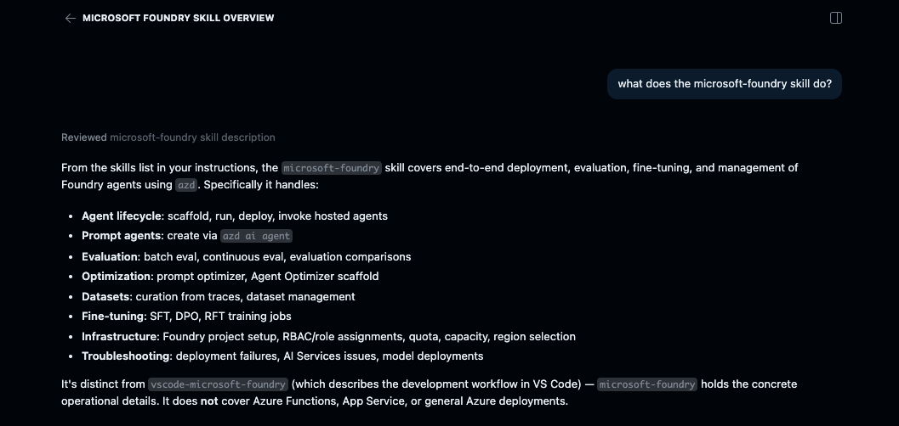

Once the top-level skills answer looks right, ask Copilot to enumerate the sub-skills we will use in this workshop and to draft prompts for our agent:

```text
List all the available sub-skills in microsoft-foundry and give me a
well-structured prompt I can use to activate each one for my
contoso-travel-concierge-prompt agent so I can get reliable and
cost-effective responses.
```

We are doing two things at once: confirming the sub-skill catalog is reachable, and getting a scaffold of prompts we can reuse throughout the walkthrough. Keep the response handy — we will refer back to individual sub-skills as we hit each stage of the loop.

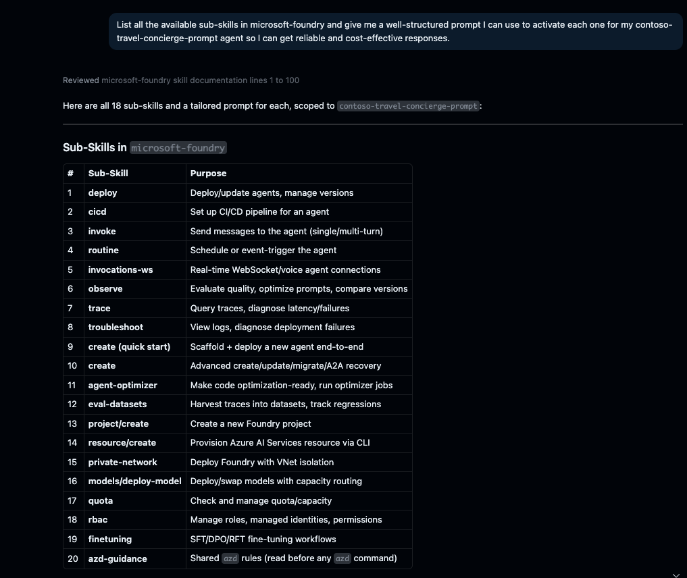

At the end of that response, Copilot summarizes a **high-value sequence** for making a prompt agent reliable and cost-effective:

> `observe (eval + prompt_optimize) → models/deploy-model (gpt-4o-mini at right TPM) → agent-optimizer → eval-datasets (regression guard) → cicd (automate the loop)`

That sequence maps onto the loop we walk in §7 and later chapters: observe first, right-size the model, run the optimizer, add regression guards, then automate. If we lose the thread later, this line is the map back.

### 6.4 Copilot Chat vs. Copilot CLI

We use Copilot Chat here. The Copilot CLI (`copilot`) is already installed and can drive the same workflows from a terminal:

```bash
copilot --help
```

Chat gives us rich rendering during learning; the CLI is convenient for scripted or headless runs later. Either interface uses the same skills and MCP servers.

### 6.5 Tips

- 💡 If the model dropdown does not show Claude Sonnet 4.6, pick another Sonnet or GPT-class model with tool use — the walkthrough works with any capable agent model.
- 💡 If Copilot loses tool access mid-session, restart the chat view. The MCP connection re-establishes.
- ⚠️ If Copilot cannot list Foundry skills after enabling the MCP server, it is usually the Azure sign-in that timed out. Sign in again from the MCP prompt.

### 6.6 Sample prompts

Copilot's response to the §6.3 follow-up includes ready-to-use prompts for each `microsoft-foundry` sub-skill. We keep them in one place so we can copy them into Chat as we hit each stage of the loop.

The 20 sub-skills group into six areas:

- **Agent workflows:** `deploy`, `cicd`, `invoke`, `routine`, `invocations-ws`
- **Quality & diagnostics:** `observe`, `trace`, `troubleshoot`
- **Create & optimize:** `create` (quick start), `create`, `agent-optimizer`, `eval-datasets`
- **Infrastructure & models:** `project/create`, `resource/create`, `private-network`, `models/deploy-model`
- **Governance:** `quota`, `rbac`
- **Advanced:** `finetuning`, `azd-guidance`

| Sub-skill | Prompt |
|---|---|
| `deploy` | Using the microsoft-foundry deploy sub-skill, deploy the latest version of my contoso-travel-concierge-prompt agent to my Foundry project. Check that the agent.yaml is correct, run a smoke-test after deployment, and confirm the deployment succeeded. |
| `cicd` | Using the microsoft-foundry cicd sub-skill, set up a GitHub Actions CI/CD pipeline for the contoso-travel-concierge-prompt agent. The pipeline should run on push to main, deploy via azd, and fail fast if the smoke-test fails. |
| `invoke` | Using the microsoft-foundry invoke sub-skill, send a multi-turn test conversation to the contoso-travel-concierge-prompt agent:<br>Turn 1: "Find me a round-trip flight CT-FL-001 from Seattle to Boston."<br>Turn 2: "Also book hotel CT-HT-003 for the same dates."<br>Show the full request/response for each turn. |
| `routine` | Using the microsoft-foundry routine sub-skill, schedule the contoso-travel-concierge-prompt agent to run a daily health-check routine at 06:00 UTC. Define the routine in azure.yaml and deploy it via azd. |
| `invocations-ws` | Using the microsoft-foundry invocations-ws sub-skill, connect to the contoso-travel-concierge-prompt agent over the invocations_ws WebSocket protocol for a real-time streaming session and show the handshake flow. |
| `observe` | Using the microsoft-foundry observe sub-skill, run a batch evaluation of the contoso-travel-concierge-prompt agent on the latest eval dataset. Score for groundedness, relevance, and coherence. Then use the prompt_optimize MCP tool to suggest improved agent instructions based on low-scoring turns. |
| `trace` | Using the microsoft-foundry trace sub-skill, query the last 24 hours of traces for the contoso-travel-concierge-prompt agent. Identify the five slowest turns, correlate any eval failures to specific trace IDs, and surface error patterns via App Insights customEvents. |
| `troubleshoot` | Using the microsoft-foundry troubleshoot sub-skill, pull the deployment and runtime logs for the contoso-travel-concierge-prompt agent. Identify any 5xx errors or tool-call failures in the last hour and suggest fixes. |
| `create` (quick start) | Using the microsoft-foundry create quick-start sub-skill, scaffold a brand-new hosted version of the Contoso Travel Concierge agent from scratch — provision a Foundry project, deploy the agent with azd, and run a smoke-test, all in one end-to-end flow. |
| `create` (advanced) | Using the microsoft-foundry create sub-skill, migrate the existing contoso-travel-concierge-prompt agent to a hosted agent, wire the flights / hotels / car-rentals data connections at scaffold time, and configure A2A routing for a future sub-agent. |
| `agent-optimizer` | Using the microsoft-foundry agent-optimizer sub-skill, make the contoso-travel-concierge-prompt agent code optimization-ready, configure eval.yaml, run an Agent Optimizer job, review the top candidate, apply it locally, and redeploy via azd. |
| `eval-datasets` | Using the microsoft-foundry eval-datasets sub-skill, harvest the last week of production traces from the contoso-travel-concierge-prompt agent into a versioned evaluation dataset. Split it 80/20 for eval/regression and surface any quality regressions compared to the previous dataset version. |
| `project/create` | Using the microsoft-foundry project/create sub-skill, create a new Microsoft Foundry project named contoso-travel-dev in East US 2 for hosting the Contoso Travel Concierge agent family. |
| `resource/create` | Using the microsoft-foundry resource/create sub-skill, provision an Azure AI Services multi-service resource for the Contoso Travel Concierge project using the Azure CLI. Use SKU S0, location East US 2, and tag it env=dev. |
| `private-network` | Using the microsoft-foundry private-network sub-skill, deploy the Contoso Travel Concierge Foundry project with BYO VNet isolation, restricting all data-plane traffic to the private endpoint and validating connectivity after deployment. |
| `models/deploy-model` | Using the microsoft-foundry models/deploy-model sub-skill, deploy gpt-4o-mini to the contoso-travel-concierge Foundry project. Find a region with sufficient capacity, set TPM to 50K, and confirm the deployment is healthy — this keeps inference costs low for the travel concierge workload. |
| `quota` | Using the microsoft-foundry quota sub-skill, check the current quota usage for GPT-4o and GPT-4o-mini in East US 2 for the subscription hosting the contoso-travel-concierge-prompt agent. Flag any limits that could block a scale-out and show how to request an increase if needed. |
| `rbac` | Using the microsoft-foundry rbac sub-skill, audit the role assignments on the contoso-travel-concierge Foundry project. Ensure the hosted agent's managed identity has only the minimum required roles (no Owner/Contributor over-grants) and that the CI/CD service principal has Azure AI Developer. |
| `finetuning` | Using the microsoft-foundry finetuning sub-skill, run an SFT distillation fine-tuning job for the contoso-travel-concierge-prompt agent using the harvested eval dataset. Calibrate a grader on groundedness, train, pick the best checkpoint, deploy it, and run a before/after eval comparison. |
| `azd-guidance` | Using the microsoft-foundry azd-guidance sub-skill, review all azd rules that apply to the contoso-travel-concierge-prompt agent project — especially the AZURE_DEV_USER_AGENT setting — and confirm my local azd environment is correctly configured before I run any azd commands. |

> 💡 As we refine prompts in later chapters, come back and update this table. It becomes our personal Concierge prompt book.

### 6.7 Getting the most from Copilot + Foundry skills

The `microsoft-foundry` skill and its 20 sub-skills each define required pre-checks, cache reuse, and multi-step orchestration. Copilot performs best when our prompts feed those rules directly instead of leaving Copilot to guess. The following patterns come straight from the skill's own mandatory rules and behavioral guardrails.

- **Name the sub-skill in the prompt.** Say "Using the `microsoft-foundry` observe sub-skill …" so Copilot loads that workflow document instead of picking a general path. The skill routes intent to specific docs (`observe`, `deploy`, `agent-optimizer`, etc.) — an unnamed intent may skip pre-checks.
- **Set project context up front.** Name the agent (`contoso-travel-concierge-prompt`), the agent type (`prompt` or `hosted`), the azd environment (`contoso-travel`), and the Foundry project endpoint when we know them. The skill's context-resolution flow explicitly skips already-known values, so up-front context saves round trips.
- **Prefer azd for hosted agents, Foundry MCP for prompt agents.** The skill states this rule outright. If our request mixes both, say which surface we want Copilot to drive.
- **Set `AZURE_DEV_USER_AGENT=microsoft_foundry_skill` inline for azd commands.** Skill's shared rule #1. Ask Copilot to include it in every `azd` command it proposes. Never persist it into `.env`, `azure.yaml`, or `azd env set`.
- **Ask for a plan before execution.** The skill's "Confirm before changes" rule says show diff/summary before modifying code, cache, or deploys. Prompts like "show me the plan first" or "dry-run only" reliably surface that step.
- **Reuse the `.foundry/` cache before regenerating.** For evaluations, add "reuse existing evaluation suites, datasets, and evaluators if they are valid" — this maps to the observe skill's rule #3 and prevents unnecessary regeneration and cost.
- **Start with smoke suites.** For eval runs, say "start with `tier=smoke` suites before regression or coverage" — this matches the observe skill's rule #4 and gives us the fastest signal.
- **Anchor with concrete data.** Include the dataset name/version, trace window, resource group, region, or model deployment name. Every named value reduces one `ask_user` step and one ambiguity in the routing table.
- **Ask Copilot to use `--no-client` for `azd ai agent run`.** Shared rule #3. Prevents Copilot from launching an interactive client in Codespaces where it will hang.
- **Offload long-running actions to sub-agents.** For polling, image builds, or env-var scans, say "delegate to a sub-agent" — the skill explicitly recommends `runSubagent` / `task` for those.
- **End with an explicit verification step.** Ask Copilot to smoke-test, invoke the agent once, or run `agent_container_status_get` after a deploy. The skill's flows include verification, but it is easier to remember when we ask for it.

> 💡 **Rule of thumb:** every high-quality prompt names the **sub-skill**, the **agent**, the **environment**, and the **verification step**. If any of the four is missing, expect Copilot to ask us for it.

### 6.8 Custom evaluators and rubrics

The `observe` sub-skill supports the full rubric lifecycle from §3.3. Two paths:

- **Auto-generate.** `evaluator_generation_job_create` builds a rubric-based evaluator from the current agent, dataset, and prompt. Passing `evaluatorName` regenerates a named rubric.
- **Author manually.** `evaluator_catalog_create` registers a custom evaluator whose `promptText` is a rubric with placeholders like `{{query}}`, `{{response}}`, and `{{expected_behavior}}` — the skill ships a `behavioral_adherence` example.

Rules the skill enforces (worth remembering before we design a rubric):

- **Check the catalog first.** Call `evaluator_catalog_get` before authoring — the skill treats duplicates as a smell.
- **Fixed output contract.** The evaluator runtime returns `result` + `reason`. Do NOT put `score`/`reasoning` or any alternate `OUTPUT FORMAT` block in `promptText`. Strip a user-supplied schema before registering.
- **Per-query behavior anchors.** Every seed dataset row should include an `expected_behavior` string so the rubric grades against a per-row description of a good answer, not only global instructions.
- **Two-phase fallback.** If auto-generation is unavailable, baseline with ≤ 5 built-ins first, cluster failures, then create a custom rubric only for the dimension built-ins can't capture.
- **Real-time-data caveat.** If the agent uses live sources, add "accept sourced claims you cannot verify" to the rubric — otherwise the judge model's knowledge cutoff will produce systematic false negatives.
- **Versioning.** Rubrics are versioned. `evaluator_catalog_delete` needs both `name` and `version` — no "delete all versions" shortcut.

This is our answer to §3.3's "evaluation rubric as a measurement instrument." We introduce a first rubric during Evaluate (§7 fundamentals), use production traces to improve it in the Core labs, and treat rubric-driven optimization as a first-class task in the Capstone.

<div align="center">· · ·</div>

## 7. Fundamentals walkthrough

We walk through the fundamentals as a single narrative. Each step keeps the same seven sub-parts from [§4](#4-how-we-document-each-lab).

### 7.1 Verify our starting point

#### Developer question

> ❓ *Do I have everything I need on this machine, and am I starting from a clean slate?*

#### What problem are we solving?

Before we provision anything in Azure, we want confidence that our development environment is complete and repeatable. If a tool is missing, an extension is out of date, or an earlier run left state behind, later labs will fail in confusing ways.

#### How are we solving it?

We check three things in order:

1. **Tools:** the Python, Azure CLI, Azure Developer CLI (`azd`), GitHub CLI (`gh`), and GitHub Copilot CLI (`copilot`) versions we will use throughout the workshop.
2. **azd extensions:** the three Foundry extensions we rely on — `azure.ai.agents`, `azure.ai.projects`, and `azure.ai.inspector`.
3. **State:** whether we are signed in and whether an `.azure/` folder or root `.env` file already exists from a previous run.

A Foundry project is the workspace that holds our agents, model deployments, evaluations, and traces. The three `azd` extensions above are the pieces `azd` uses to create and inspect that project from the command line.

#### Exercise: lab steps

Related lab: [Fundamentals · Lab 01 — Provision with `azd`](../fundamentals/01-provision-azd.md).

**Fast path — run the preflight script.** Idempotent and safe to re-run at any point:

```bash
./labs/_devguide/quickstart.sh
```

It walks the same four groups below and prompts before making any change (install an `azd` extension, run `az login`, or run `azd auth login`). Use `--yes` to accept prompts non-interactively, `--quiet` to see only failures and the summary.

Example starting-state output — devcontainer ready, extensions up to date, not yet signed in:

```text
==> 1. Tools
  ✓ python present
    Python 3.13.5
  ✓ az present
    {
  "azure-cli": "2.89.1",
  "azure-cli-core": "2.89.1",
  ✓ azd present
    azd version 1.31.2 (commit XXX) (stable)
  ✓ gh present
    gh version 2.98.0 (2026-08-20)
    https://github.com/cli/cli/releases/tag/v2.98.0
  ✓ copilot present
    GitHub Copilot CLI 1.0.80.
    Run 'copilot update' to check for updates.

==> 2. Foundry azd extensions
  ✓ azure.ai.agents up to date
  ✓ azure.ai.projects up to date
  ✓ azure.ai.inspector up to date

==> 3. Authentication
  ✗ az not signed in
    run 'az login --use-device-code' now? [y/N]
```

The script pauses here and offers to sign us in. We can answer **y** to go through the browser sign-in flow inline, or **n** and sign in ourselves — either path is fine.

Once we are signed in, re-running the script gives us the all-green ready-to-provision state:

```text
==> 1. Tools
  ✓ python present
    Python 3.13.5
  ✓ az present
    {
  "azure-cli": "2.89.1",
  "azure-cli-core": "2.89.1",
  ✓ azd present
    azd version 1.31.2 (commit XXX) (stable)
  ✓ gh present
    gh version 2.98.0 (2026-08-20)
    https://github.com/cli/cli/releases/tag/v2.98.0
  ✓ copilot present
    GitHub Copilot CLI 1.0.80.
    Run 'copilot update' to check for updates.

==> 2. Foundry azd extensions
  ✓ azure.ai.agents up to date
  ✓ azure.ai.projects up to date
  ✓ azure.ai.inspector up to date

==> 3. Authentication
  ✓ az signed in
    subscription: XXX
  ✓ azd signed in

==> 4. Workspace state
  ✓ no prior .azure/ folder
  ✓ no prior .env file

==> Summary
  ✓ ready to provision.
```

**Manual path — run the checks by hand.** Useful the first time so we know what the script is doing.

Run the tool checks:

```bash
python --version
az version
azd version
gh --version
copilot version
```

Example output from a working environment:

```text
Python 3.13.5

{
  "azure-cli": "2.89.1",
  "azure-cli-core": "2.89.1",
  "azure-cli-telemetry": "1.1.0",
  "extensions": {}
}

azd version 1.31.2 (commit XXX) (stable)

gh version 2.98.0 (2026-08-20)
https://github.com/cli/cli/releases/tag/v2.98.0

GitHub Copilot CLI 1.0.80
```

Confirm the Foundry `azd` extensions are installed and current:

```bash
azd extension list --installed
```

Example output:

```text
ID                   NAME                             STATUS       INSTALLED       LATEST          SOURCE
────────────────────────────────────────────────────────────
azure.ai.agents      Foundry agents (Beta)            Up to date   1.0.0-beta.11   1.0.0-beta.11   azd
azure.ai.inspector   Foundry Agent Inspector (Beta)   Up to date   1.0.0-beta.4    1.0.0-beta.4    azd
azure.ai.projects    Foundry Projects (Beta)          Up to date   1.0.0-beta.6    1.0.0-beta.6    azd
```

Check authentication and starting state:

```bash
az account show
azd auth status
test -d .azure && echo ".azure exists" || echo "no .azure folder"
test -f .env && echo ".env exists" || echo "no .env file"
```

Example clean-slate output:

```text
Please run 'az login' to setup account.
Not logged in, run `azd auth login` to login to Azure
no .azure folder
no .env file
```

#### What did we learn?

- We know which versions of Python, `az`, `azd`, `gh`, and `copilot` are on this machine.
- We know the three Foundry `azd` extensions are present and up to date.
- We know we are unauthenticated and have no leftover `azd` environment or `.env` file, so the next step provisions from a clean state.

#### Extension

- Run `azd extension show azure.ai.agents` to see extension metadata and its declared capabilities.
- Run `az extension list -o table` and note that the Foundry extensions live under `azd`, not `az`. Understanding which CLI owns which extension helps us pick the right command later.

#### Tips

- 💡 If any of the five tools is missing, install it before continuing. The devcontainer in this repo includes all of them.
- 💡 If an `azd` extension shows `Update available`, run `azd extension upgrade <id>` to move to the latest before provisioning.
- ⚠️ If `.azure/` or `.env` already exists from an earlier attempt, we are not on a clean slate. Decide whether to reuse or remove that state before continuing — reusing an old environment can point us at soft-deleted or partially provisioned resources.
- 🔎 **Walkthrough note:** the current [Lab 01](../fundamentals/01-provision-azd.md) begins at `az login`. The devguide adds the tool and extension checks above so we notice missing pieces before authenticating. Not a discrepancy in behavior, only in scope.

### 7.2 Provision the fundamentals slice

#### Developer question

> ❓ *What Azure infrastructure does my prompt agent need, and how do I stand it up without over-provisioning?*

#### What problem are we solving?

Before we touch the Foundry portal, we need a resource group, a Foundry project, two model deployments, Log Analytics + Application Insights, storage, and the right developer RBAC. Doing that by hand is a dozen `az` commands, easy to drift from what the labs actually assume. Doing the full hosted-agent provisioning up front creates paid resources (ACR, capability host, hosted-agent runtime) we won't use until the capstone.

#### How are we solving it?

We run **one script** — [`labs/_devguide/01-provision.sh`](01-provision.sh) — that drives `azd provision` against the repo's tested Bicep with `ENABLE_HOSTED_AGENTS=false`. Result: the fundamentals slice only. When we reach the capstone, `02-hosted-agent.sh` flips the flag and re-provisions into the SAME resource group; Bicep's deterministic resource-token leaves everything already there untouched and only adds the hosted-agent modules.

Why `azd` (not a hand-rolled `az` script)?

- The Bicep already declares the full stack, including the developer RBAC. We'd reimplement it in bash and drift on every infra change.
- Bicep's deterministic resource-token is what makes the reuse guarantee work in `02-hosted-agent.sh`.
- If we were only ever building prompt agents, a series of `az` commands or a simpler "standard agents" `azd` template would be enough. Our goal is one template that also supports the hosted-agent capstone.

Every run gets a **fresh random 4-hex suffix** for the azd env name and the resource group name. That side-steps the soft-deleted Cognitive Services collision that would otherwise block a re-run. To re-enter an existing env, pass `AZD_ENV_SUFFIX=<same-4-char>`.

#### Exercise: lab steps

Related labs: [Fundamentals · Lab 01 — Provision with `azd`](../fundamentals/01-provision-azd.md), [Lab 03 — Deploy models](../fundamentals/03-deploy-models.md).

```bash
./labs/_devguide/01-provision.sh
```

Example clean run (subscription, tenant, principal, resource-token, and deployment IDs masked):

```text
==> 0. Context
  ✓ azd env name: contoso-travel-8a40
  ✓ resource group: rg-contoso-travel-8a40
  ✓ location: eastus2
  ✓ suffix source: random
    each run gets a fresh random suffix by default — override with AZD_ENV_SUFFIX=<4-char> to reuse an env
  ✓ repo root: /workspaces/agent-optimization-workshop

==> 1. Auth prerequisites
  ✓ az signed in
    subscription: XXX
  ✓ azd signed in

==> 2. azd environment
  ✗ azd env 'contoso-travel-8a40' missing
    run 'azd env new contoso-travel-8a40' now? [y/N] y
New environment 'contoso-travel-8a40' was set as default
  ✓ azd env 'contoso-travel-8a40' created
  ✓ pinned AZURE_LOCATION, AZURE_RESOURCE_GROUP, ENABLE_HOSTED_AGENTS=false

==> 3. Provisioning (fundamentals slice)
  ✗ resource group 'rg-contoso-travel-8a40' missing
    run 'azd provision' now? (~2-3 minutes, creates paid Azure resources) [y/N] y

Provisioning Azure resources (azd provision)
Provisioning Azure resources can take some time.

  (✓) Done: Downloading Bicep
Subscription: XXX (XXXXXXXX-XXXX-XXXX-XXXX-XXXXXXXXXXXX)
Location: East US 2

  You can view detailed progress in the Azure Portal:
  https://portal.azure.com/#view/HubsExtension/DeploymentDetailsBlade/~/overview/id/%2Fsubscriptions%2FXXXXXXXX-XXXX-XXXX-XXXX-XXXXXXXXXXXX%2Fproviders%2FMicrosoft.Resources%2Fdeployments%2Fcontoso-travel-8a40-XXXXXXXXXX

  (✓) Done: Resource group: rg-contoso-travel-8a40 (645ms)
  (✓) Done: Foundry: ai-account-XXXXXXXXXXXXX (21.84s)
  (✓) Done: Azure AI Services Model Deployment: ai-account-XXXXXXXXXXXXX/gpt-5.4-mini (2.47s)
  (✓) Done: Log Analytics workspace: logs-XXXXXXXXXXXXX (24.723s)
  (✓) Done: Azure AI Services Model Deployment: ai-account-XXXXXXXXXXXXX/gpt-5.4-judge (3.876s)
  (✓) Done: Foundry project: ai-account-XXXXXXXXXXXXX/ai-project-contoso-travel-8a40 (6.548s)
  (✓) Done: Application Insights: appi-XXXXXXXXXXXXX (1.441s)
  (✓) Done: Foundry project connection: ai-account-XXXXXXXXXXXXX/ai-project-contoso-travel-8a40/appi-XXXXXXXXXXXXX (5.168s)
  (✓) Done: Container Registry: crXXXXXXXXXXXXX (22.25s)
  (✓) Done: Foundry project connection: ai-account-XXXXXXXXXXXXX/ai-project-contoso-travel-8a40/acr-XXXXXXXXXXXXX (687ms)

SUCCESS: Your application was provisioned in Azure in 1 minute 48 seconds.
  ✓ azd provision complete

==> 4. Developer RBAC (post-provision check)
  ✓ Foundry User
  ✓ Foundry Project Manager

==> 5. Populate .env
  ✓ .env written at /workspaces/agent-optimization-workshop/.env
    review before committing — this file contains subscription and tenant IDs

==> Summary
  ✓ fundamentals ready. next: open the Foundry portal for §7.3.
         when you reach the capstone, run: ./labs/_devguide/02-hosted-agent.sh

         to reuse this env in a later shell:
             AZD_ENV_SUFFIX=8a40 ./labs/_devguide/01-provision.sh
```

Total time: about **2 minutes** on a warm subscription.

Once the script reports "fundamentals ready", we cross-check what got created in the two portals we will spend the rest of the workshop in:

**Azure portal — the resource group.** All the infra objects (Foundry account, model deployments, Log Analytics, App Insights, ACR, connections) live under `rg-contoso-travel-<suffix>`. This is the platform view.

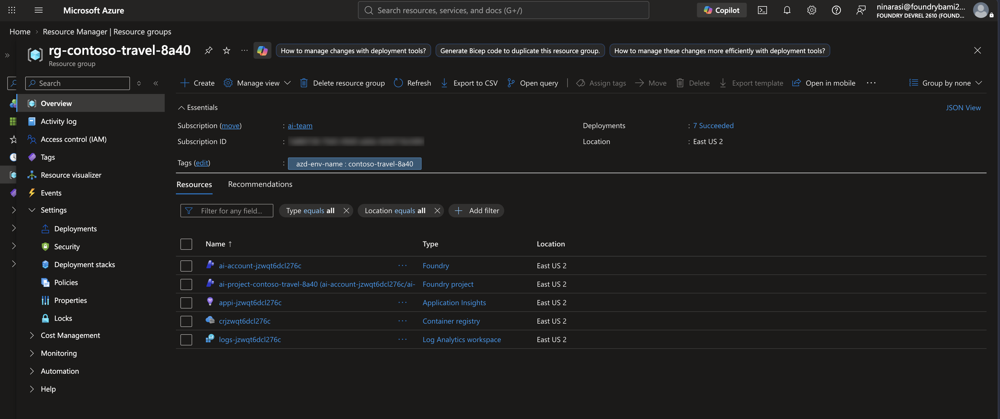

**Get to Foundry from here.** Click the Foundry resource (`ai-account-<hash>`) in the resource group, then click **Go to Foundry portal** at the top of its overview blade. No separate sign-in required — the same Entra identity carries over.

**Foundry portal — the AI account and project.** The Foundry portal reads the same Foundry resource but exposes the developer surface: agents, models, evaluations, and traces. This is the pane we drive the rest of the fundamentals labs from.

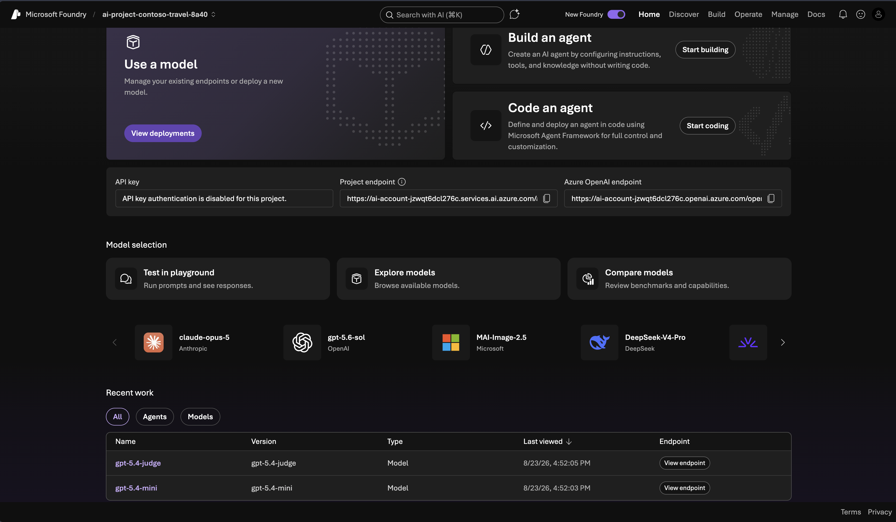

#### What did we learn?

- The Bicep provisions ten resources — resource group, Foundry account, both model deployments (`gpt-5.4-mini` + `gpt-5.4-judge`), Log Analytics, Foundry project, Application Insights, Container Registry, plus two Foundry project connections (App Insights + ACR).
- With `ENABLE_HOSTED_AGENTS=false`, the capability host is skipped. The container registry is still created because it's a Foundry project connection, not a hosted-agent-only dependency — but it stays idle until the capstone.
- The resource-token (`XXXXXXXXXXXXX` in the example above) is deterministic per (subscription, resource group, location). Same RG next time we run `azd provision` in this env → same resource names → Bicep treats existing resources as unchanged. This is what makes `02-hosted-agent.sh` safe to run against the same env later.
- The developer principal is granted two roles at the Foundry account scope: **Foundry User** (data-plane access to models and projects) and **Foundry Project Manager** (project administration). When the hosted-agent bits are added in §7.‹future›, we also verify **Storage Blob Data Contributor** on the eval-dataset storage account.
- A `.env` at repo root is written from `sample.env`, filled in with values from `azd env get-values`. Local scripts and tooling can then load Foundry endpoint, App Insights connection string, and model deployment names without an `azd env select` call.

#### Extension

- Run the script again with the printed reuse command (`AZD_ENV_SUFFIX=<hex>`) and confirm it detects the existing env + RG and skips provisioning (~5 seconds).
- Run `azd env get-values` to see every variable the Bicep emitted — this is exactly the surface the sub-skills read from.
- Open the Azure portal deployment link the script printed and inspect the Bicep template deployment to see the module tree.

#### Tips

- 💡 A resource-group name like `rg-contoso-travel-8a40` is *deliberately* not memorable. When we return to this Codespace later, `azd env list` or `ls .azure/` tells us which env is current. `02-hosted-agent.sh` and `03-capstone-agent.sh` auto-pick the most recent `contoso-travel-*` env, so we usually don't need to remember the suffix.
- 💡 The suffix collision-check inside the script also probes for **soft-deleted** Cognitive Services accounts under the target RG. If a random hex somehow collided with a purged-but-not-yet-drained account name, the script would pick a different suffix silently.
- ⚠️ **Cost note:** everything in the fundamentals slice is either free or metered per-request. The Container Registry is the only always-on Basic-tier resource — a few USD/month idle. Teardown is `azd down` inside the env folder.
- 🔎 **Walkthrough note:** the current [Lab 01](../fundamentals/01-provision-azd.md) uses a fixed `rg-contoso-travel` (no suffix). The devguide switches to a random suffix so re-runs don't collide with soft-deleted resources; the labs will pick this pattern up in the next content pass.

### 7.3 Choose our model with eyes open

#### Developer question

> ❓ *Why gpt-5.4-mini for the Concierge — not gpt-5.4 or gpt-5.4-nano?*

#### What problem are we solving?

Our provisioning already deployed two models: `gpt-5.4-mini` for the Concierge and `gpt-5.4-judge` (a `gpt-5.4` deployment) as the evaluator. Before we build the agent on top, we owe ourselves a two-minute detour to understand **why** that pairing is the right starting point — and what we would trade off if we picked the tier above or below. This is the same lens we return to in §3.3 and the capstone when we ask "what if each agent uses a different model?"

#### How are we solving it?

The Foundry portal's **Discover → Compare models** view puts frontier, mid, and small variants of the same family side by side across four dimensions: **quality**, **safety**, **cost**, and **throughput**. We use it to make the model choice a considered decision, not a default.

Three concepts to notice before we open the view:

- **Frontier model** — the biggest, most capable model in the family. Best quality; highest cost; slowest.
- **Mid model** — smaller variant tuned for balance. Meaningful quality drop but usually 5-10× cheaper and much faster.
- **Small/nano model** — smallest variant. Fastest and cheapest; noticeable quality drop for reasoning-heavy tasks.

For an agent that reads structured JSON, asks clarifying questions, and assembles an itinerary from lookups — the workload we spec'd in §2 — the mid model usually beats the frontier on **cost-per-useful-answer**.

#### Exercise: lab steps

1. In the Foundry portal sidebar, click **Discover** → **Model catalog**.
2. Filter or scroll to the `gpt-5.4` family so all three variants are visible.

   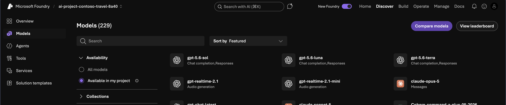

3. Select `gpt-5.4`, `gpt-5.4-mini`, and `gpt-5.4-nano`, then click **Compare models**.
4. Read across the four benchmark rows.

   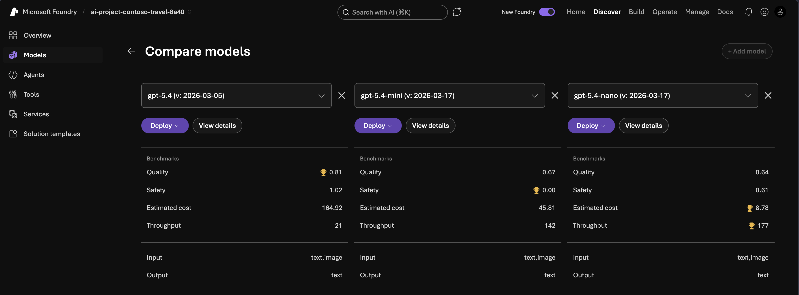

5. From this run's observed comparison:
   - `gpt-5.4` → best quality, highest cost, lowest throughput.
   - `gpt-5.4-nano` → lowest cost, lowest quality; fastest.
   - `gpt-5.4-mini` → the middle ground on all four axes.

6. That's why our provisioning picked `gpt-5.4-mini` for the Concierge: it fits the workload without paying the frontier tax on every turn.

#### What did we learn?

- Foundry gives us the tradeoff surface before we commit — quality, safety, cost, throughput on one screen.
- Model selection is a **Plan-stage** decision, not a runtime one. Picking wrong here shows up everywhere later (traces get slower, eval bills climb, monitoring alerts fire).
- The `gpt-5.4-judge` deployment is intentionally the frontier model. When it's the judge, we want its scoring to be as accurate as possible — that's the one place we do pay the tax, and only during eval runs.
- The mid-tier is a starting point, not a permanent commitment. §3.3's Agent Optimizer will later propose model candidates as part of its optimization search.

#### Extension

- Compare a non-OpenAI model family (for example a Llama or Phi variant) against the gpt-5.4 line to see whether an open-weight model would meet the workload at lower cost.
- In the Compare view, expand a specific benchmark (e.g., MMLU-Pro) to see the underlying test the "quality" number rolls up.
- Ask Copilot: *"Using the microsoft-foundry `models/deploy-model` sub-skill, what would it take to deploy `gpt-5.4-nano` alongside `gpt-5.4-mini` in this project, and what checks should I run before switching the Concierge over?"*

#### Tips

- 💡 The Compare view supports **at most three models** at a time in the current portal. If we want to sweep more, do it in pairs.
- 💡 "Cost" is normalized to input+output tokens for a reference workload. Real cost for the Concierge depends on tool-call chatter and dataset size; treat the number as a directional signal, not a bill forecast.
- ⚠️ **Do not** change the Concierge's deployment underneath a running evaluation. Model swaps are a **new agent version** — see §7.〈optimize〉 for the promote/compare flow.
- 🔎 **Walkthrough note:** the current fundamentals labs go straight from provisioning to agent creation without a Compare step. The devguide adds this detour because model choice is the highest-leverage Plan decision and worth two minutes to get right.

### 7.4 Create the prompt agent

#### Developer question

> ❓ *How do I turn my chosen model into a working Contoso Travel Concierge agent I can talk to?*

#### What problem are we solving?

We have a Foundry project with two model deployments, and we've picked `gpt-5.4-mini` as the Concierge's model. What we don't have is an **agent** — the persistent Foundry object that carries the model, instructions, tools, and versioning we'll spend the rest of the workshop iterating on.

#### How are we solving it?

A **prompt agent** is the lightest agent shape in Foundry: model + instructions + optional tools, no code, no container. The portal offers two entry points that land on the same object:

- **Build → Agents → New agent** — start from an empty agent and pick a model.
- **Build → Models → \<pick a model\> → Save as agent** — start from a model and materialize the agent around it.

We use the second path because we just came from the model conversation in §7.3 — it keeps our momentum on "the model is the anchor of this agent." Both paths produce the same result: an agent record with `version: 1` sitting in the project.

#### Exercise: lab steps

1. In the Foundry portal, go to **Build → Models**. All the deployments live here — `gpt-5.4-mini`, `gpt-5.4-judge`, plus any preview models the region has attached.

   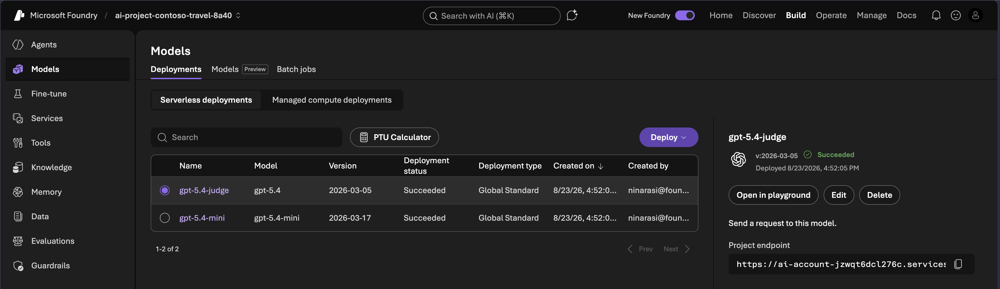

2. Click **`gpt-5.4-mini`** to open its details, then click **Save as agent** at the top of the pane.

   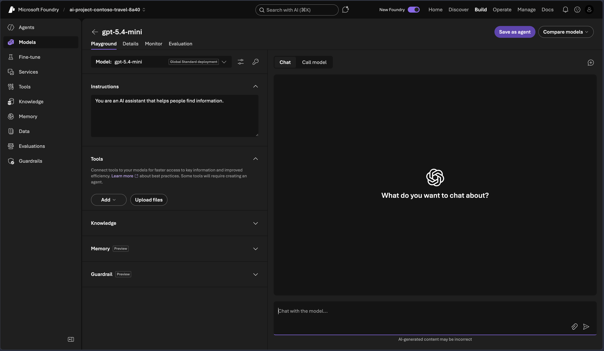

3. A short **Create an agent** dialog appears. It confirms the model, offers to prefill instructions, and asks for a name.

   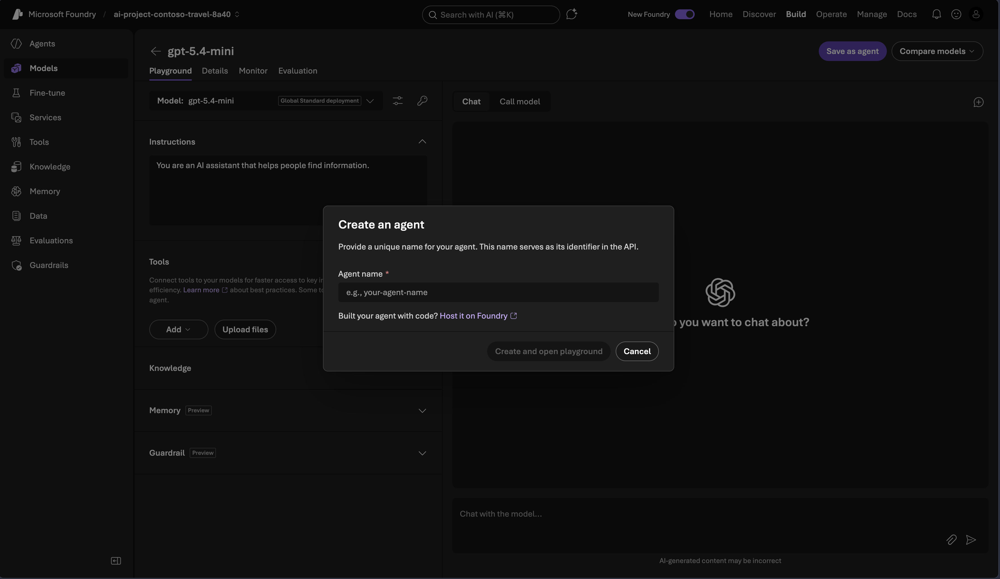

4. Enter the name **`contoso-travel-concierge-prompt`**. The `-prompt` suffix is deliberate — we keep it distinct from the hosted variant we'll build in the Capstone (§ TBD) so both agents can coexist in the same project.

   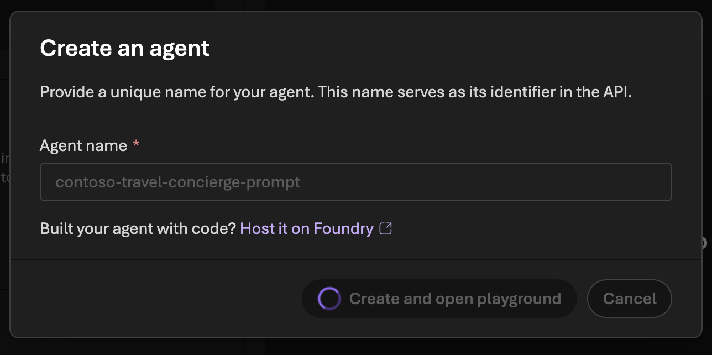

5. Click **Create and open in playground**. Foundry provisions the agent record and drops us into its playground with **version 1**.

   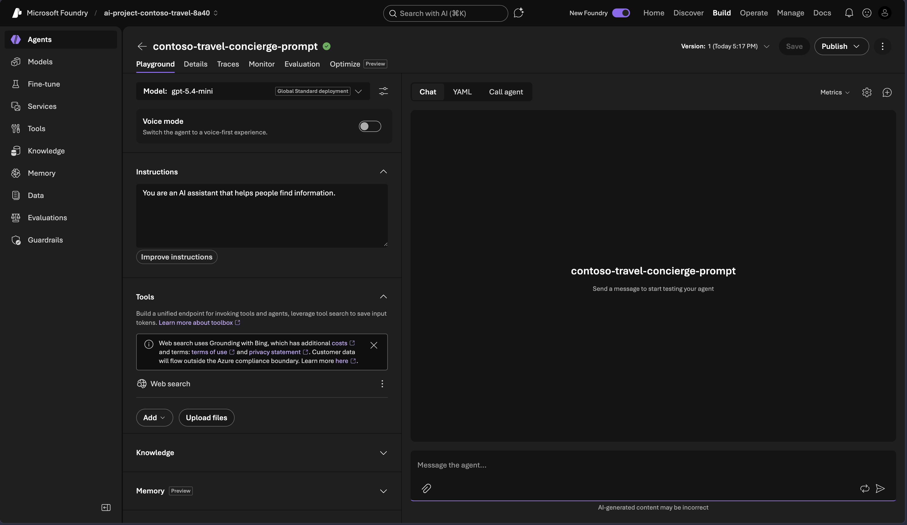

At this point we have an **empty-instructions** version-1 agent. It responds to any prompt using the model's default behavior. That's exactly what §7.5 will fix by pasting the Concierge instructions and saving version 2.

#### What did we learn?

- A **prompt agent** is created and versioned in the Foundry project — same project we've been standing in since §7.2.
- Every save creates a **new version**. Version 1 is the "just born, no instructions" snapshot. When we paste our system prompt next, we'll bump to version 2.
- The playground is the fastest way to sanity-check an agent turn. It is not the same as evaluation — the playground gives us "does it feel right on one input"; evaluation (§7.〈evaluate〉) will give us "does it meet the requirements on a whole dataset."
- Naming with the `-prompt` suffix lets us later create a `-hosted` sibling without a rename dance. This is deliberate room for §3.5 / capstone comparisons.

#### Extension

- Ask Copilot to enumerate the agent versions programmatically:
  *"Using the microsoft-foundry `deploy` sub-skill, list all versions of the `contoso-travel-concierge-prompt` agent in this project and show me the delta between them."*
- Try **Build → Agents → New agent** on a different name to see the alternative entry point. Delete that agent afterward to keep the project clean.
- In the playground, expand the **Tools** section. Notice a default **Web Search** tool is already available — worth noting for §7.〈observe〉 when we look at traces and see tool-call spans.

#### Tips

- 💡 The `-prompt` suffix is a convention only — Foundry doesn't infer anything from the name. It just protects us from name collisions later.
- 💡 **Save as agent** from the Models tab is a shortcut. Learners on **Build → Agents → New agent** land on the same result; the walkthrough note below reconciles both paths.
- ⚠️ **Do not** delete a Foundry model deployment while an agent points at it. The agent record survives but every invocation fails until the deployment is restored or the agent's model is updated to a live deployment.
- 🔎 **Walkthrough note:** the current [Lab 04](../fundamentals/04-create-prompt-agent.md) uses the **Build → Agents → New agent** entry point. The devguide uses **Models → Save as agent** because it flows better after our §7.3 model comparison. Both entry points produce an identical agent record — the labs will pick this shortcut up in the next content pass.

### 7.5 Give the Concierge its instructions

#### Developer question

> ❓ *How do I turn version 1 (empty behavior) into a travel-only Concierge that stays in scope and knows what it can look up?*

#### What problem are we solving?

Version 1 responds to any prompt using the model's defaults. It has no idea what Contoso Travel is, what data it can search, what to ask for, or when to decline. Instructions are the mechanism that shape all four.

#### How are we solving it?

We paste a **baseline seed prompt** into the agent's Instructions field and save. Foundry treats every save as an immutable new version, so this write bumps us from **v1** to **v2**. From this point on, every improvement we make in the Core labs will produce a new numbered version we can trace, compare, and roll back to.

Two things worth naming before we paste:

- The seed is **intentionally weak.** It handles simple fully-specified prompts, but under-performs on the eval set — it over-asks clarifying questions, omits IDs and prices, and makes loosely-grounded claims. That's the point. It gives §3.2 (Core hill climb) something to actually climb.
- The seed is **shape-specific.** A prompt agent talks about **datasets** it can search directly; the hosted variant (Capstone) talks about **specialist sub-agents** it can call. Same story, different mechanism. Do not paste the hosted variant into the prompt agent — it will hallucinate tools that don't exist.

#### Exercise: lab steps

1. In the playground for `contoso-travel-concierge-prompt` (from §7.4), locate the **Instructions** field.
2. Open the workshop's baseline seed file: [`artifacts/prompts/reference/prompt-agent-baseline-v1.md`](../../artifacts/prompts/reference/prompt-agent-baseline-v1.md).
3. **Copy only the prompt body, not the metadata.** The file starts with a title heading and a blockquote that explain what the baseline is *for*. That's guide metadata — do not paste it into the agent. Start copying at the `## Role` heading and go through the end of the `## Out of scope` section.

    For reference, the exact block to paste is:

    ```markdown
    ## Role

    You are the **Contoso Travel Concierge** at Contoso Travel, a premium travel
    agency that books flights, hotels, and car rentals across Paris, London,
    Tokyo, Rome, and Cancún. Be warm, professional, and concise.

    ## How you work

    You have three attached datasets:

    - **Flights** — flights (id, airline, route, cabin, price, seats)
    - **Hotels** — hotels (id, name, city, stars, nightly price, amenities)
    - **Car rentals** — rental vehicles (id, company, city, type, daily price)

    When travelers ask travel questions, look up matching rows from the relevant
    dataset before answering.

    Before answering, make sure you have everything you need. If anything is
    missing, ask the traveler first:

    - Flights: origin, destination, travel dates, cabin class
    - Hotels: city, check-in date, check-out date, star rating
    - Car rentals: city, pickup date, return date, vehicle type

    ## Response style

    Confirm what the traveler is looking for, ask any clarifying questions you
    need, then share what you found. Keep it friendly.

    ## Out of scope

    If the traveler asks about something unrelated to travel, politely decline.
    ```

4. Click **Save**. The version indicator should tick over to **v2**.

   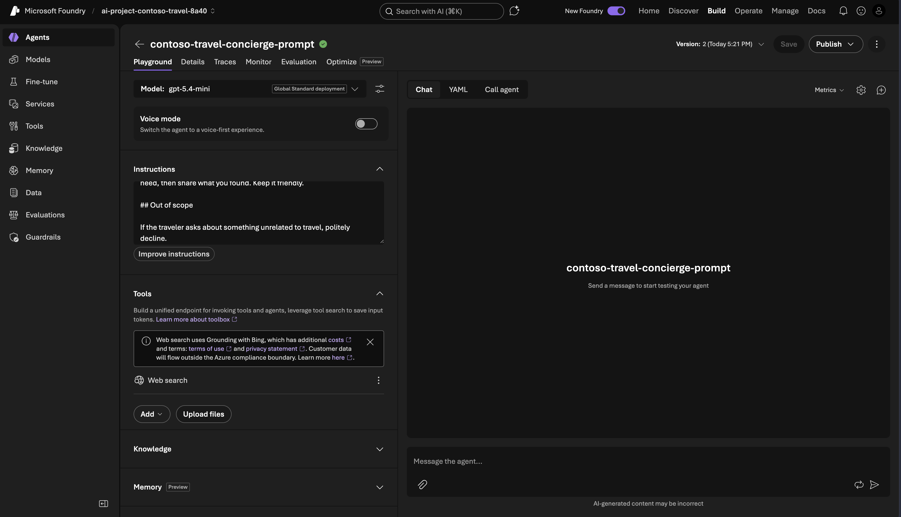

5. Note that we have not yet attached the JSON datasets. That comes in §7.〈attach-data〉 — this version will happily invent lookups if we let it. That's a deliberate teaching moment: instructions alone are not grounding.

#### What did we learn?

- Every **Save** produces a new agent version. That's the atomic unit we compare in the Optimize loop later (§3.2, §7.〈optimize〉).
- Instructions cover four responsibilities: **who the agent is**, **what it can search**, **what it needs before answering**, and **what is out of scope**. The seed does all four in about 25 lines.
- The prompt-agent instructions and the hosted-agent instructions differ by one meaningful word — "datasets" vs "specialist agents". The rest is the same. That's why the story arc (§2, §3.5) works: same requirements, different mechanism.
- We are deliberately shipping a weak baseline. It exists so §3.2 has something to hill-climb; if we tuned it perfectly here, the Core labs would have nothing to teach.

#### Extension

- Ask Copilot: *"Using the `microsoft-foundry` `deploy` sub-skill, show me the diff between v1 and v2 of the `contoso-travel-concierge-prompt` agent, including instruction text and any tool-config changes."*
- Read the alternative instructions at [`src/instructions/concierge.md`](../../src/instructions/concierge.md). Compare "datasets" vs "specialist sub-agents" language — those are the same requirements expressed for the two agent shapes.
- Trace the `Out of scope` clause: which lines of the seed prompt are actually enforcing scope? What would break if we deleted them? (We'll test this in §7.〈play〉 with the out-of-scope prompt from §2.2's journey.)

#### Tips

- 💡 The instructions field is Markdown-aware in the playground — headings and lists render for the model exactly as pasted. Keep headings short and consistent; the model uses them as chunk anchors.
- 💡 **Trim the guide metadata.** The reference file starts with a `# ... Baseline (v1)` title and a `> **Workshop seed prompt.** ...` blockquote. Those are for us, the coaches — they explain **why** the seed is deliberately weak. Do NOT paste them into the agent. Start copying at the `## Role` heading.
- 💡 If the Save button is greyed out, you likely edited then reverted — Foundry only enables Save on an actual delta. Make a trivial change (add a space) and delete it to re-enable.
- ⚠️ **Do not** paste an instructions block with `flight_agent` / `hotel_agent` / `car_rental_agent` into a prompt agent — those are hosted-agent tools that don't exist in this shape. The model will invent tool-calls we can't fulfil, which is worse than a plain lookup miss because it looks confident.
- 🔎 **Walkthrough note:** the current [Lab 04](../fundamentals/04-create-prompt-agent.md) uses the same seed prompt but doesn't call out the two-shape distinction. The devguide flags it because learners get confused when they later read `src/instructions/concierge.md` and see different language.

### 7.6 Give the Concierge its data

#### Developer question

> ❓ *How do I stop the Concierge from making up flight IDs and prices — how do I ground it in the actual Contoso travel inventory?*

#### What problem are we solving?

Version 2 has instructions but no data. If we ask "what business-class flights are available from Seattle to Paris?", the model will invent a plausible-sounding answer using its training-data knowledge — that's a hallucination, not a lookup. We also inherit an unwanted **Web Search** tool from the playground default, which quietly turns some traveler questions into internet searches instead of Contoso lookups.

Two fixes belong together:

- **Remove Web Search** so the agent can't silently route around our data.
- **Attach the three JSON datasets** so it *has* something to look up.

#### How are we solving it?

Foundry gives prompt agents two grounding surfaces:

- **Tools** — things the agent can call (web search, functions, MCP tools).
- **Knowledge** — files or vector indexes the model can retrieve from.

We turn off the built-in Web Search tool, then upload our three JSON files as a **file-upload index** the portal builds for us. The index becomes an attached knowledge source. From there the model can search actual flight, hotel, and car-rental records — not its training data.

Saving the agent again bumps us from **v2** to **v3**.

#### Exercise: lab steps

1. In the agent playground for `contoso-travel-concierge-prompt`, expand the **Tools** panel and **remove Web Search**.

   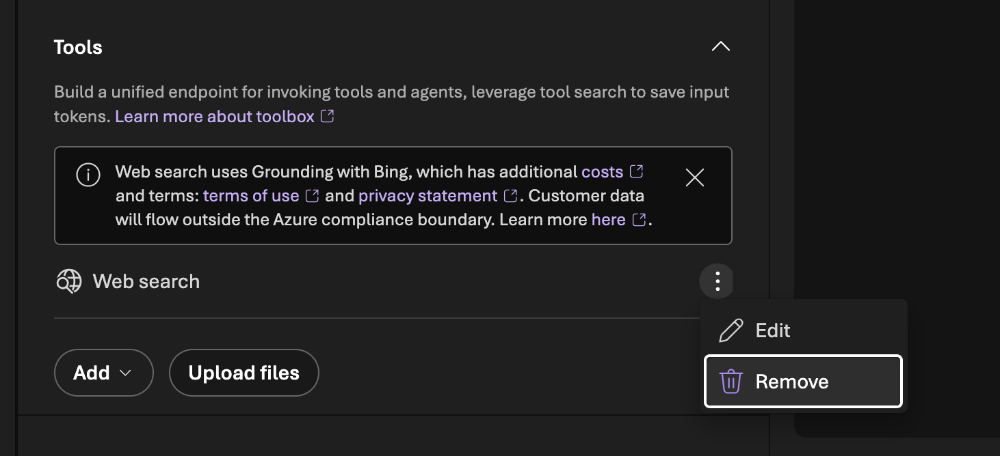

2. Open the **Knowledge** (or **Files**) panel and start the "Add files" flow.

   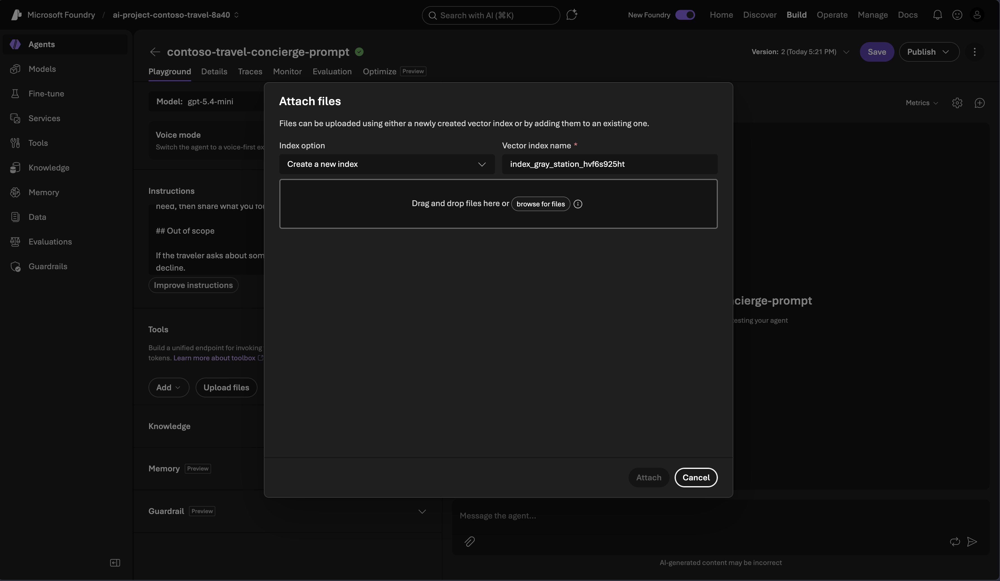

3. Upload the three JSON files from the repo's `data/json/` folder:

   - `flights.json`
   - `hotels.json`
   - `car_rentals.json`

   Give the index a stable, memorable name: **`contoso-travel-index`**. We'll reference this exact name in later labs and Copilot prompts, so keep it consistent.

4. Wait for the index to build. Foundry runs an embed job and reports back when the index is ready. Then **Save** the agent — version indicator ticks to **v3**.

   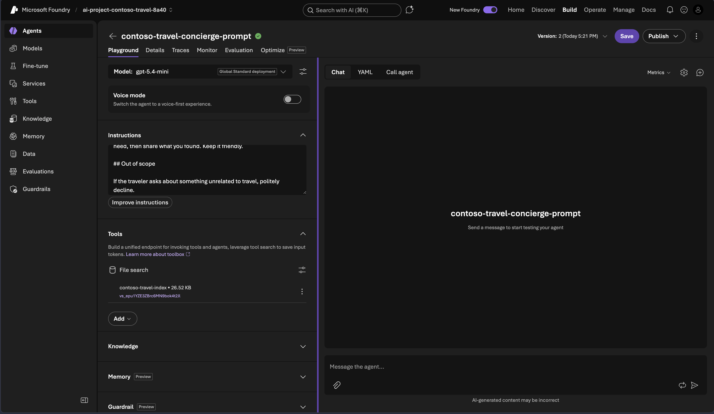

5. **Smoke-test in the playground.** In the **Chat** panel on the right, run two prompts back to back:

   **A · Specific, in-scope query:**

   > *"What business-class flights are available from Chicago to Rome under $2500?"*

   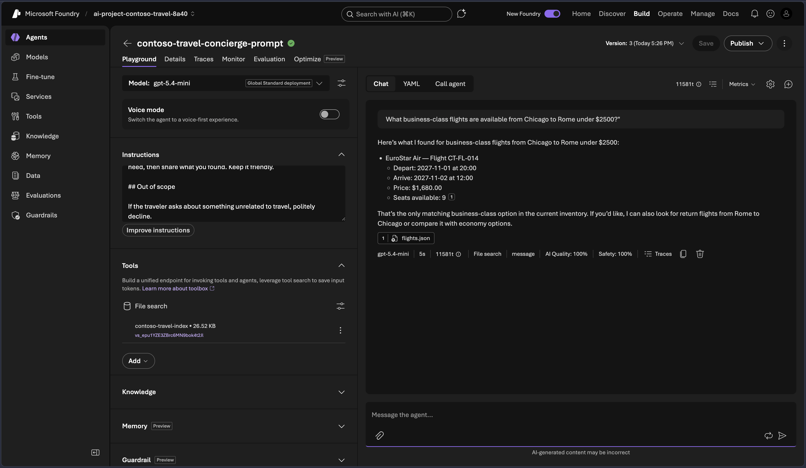

   Notice the response **cites the source** — the small numbered citation chip after the flight IDs. That's the retriever surfacing which chunks of the JSON index the model actually read. Citations are our first hint that the agent is grounded rather than guessing.

   **B · Vague, in-scope query:**

   > *"Plan a weekend in Tokyo."*

   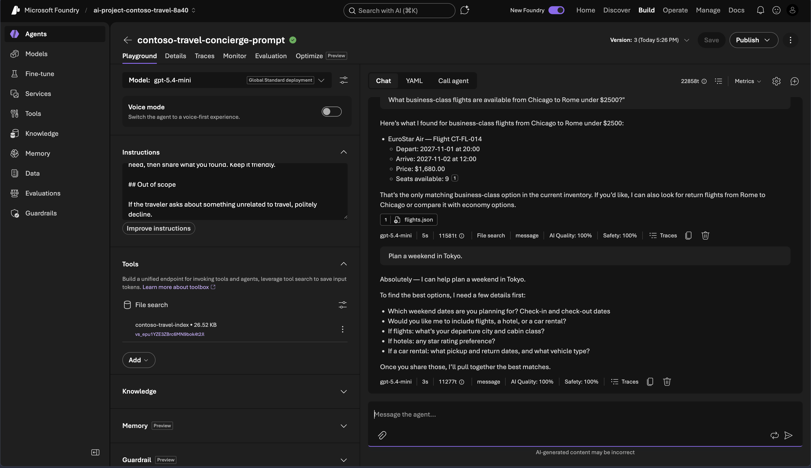

   The agent should refuse to invent an itinerary and instead **ask for the missing details** (dates, budget, cabin, hotel preferences). That behavior is coming straight from the "Before answering, make sure you have everything you need" section of the seed prompt.

   **C · Out-of-scope query:**

   > *"How do I make sourdough bread?"*

   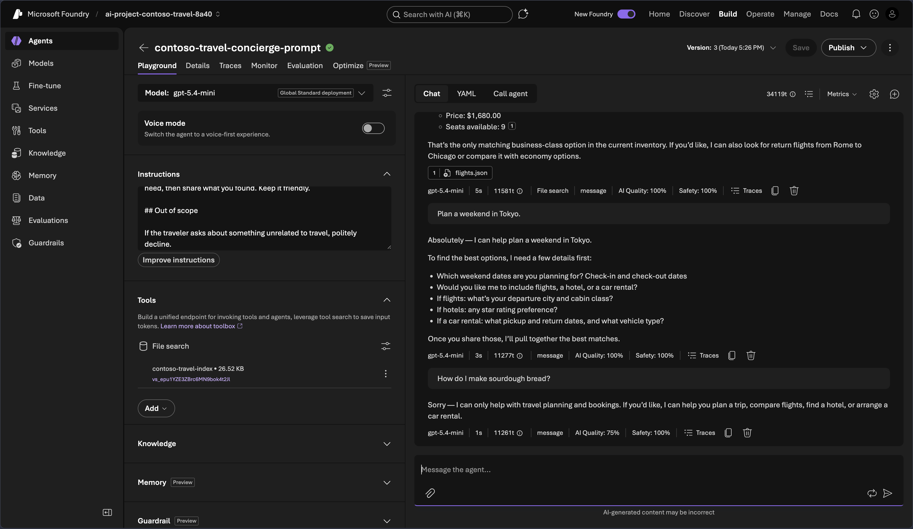

   The agent should decline politely — no recipe, no clarifying questions, no attempt to relate the topic back to travel. That refusal is coming from the "Out of scope" section of the seed prompt. If the agent tries to be helpful anyway, it's a signal that the scope clause is too weak; that becomes an optimization target in §Core.

   **Try more variants.** Out-of-scope tests are most informative when they stretch different boundaries. Coaches and self-guided learners should try a few:

   | Prompt | Why this variant is useful |
   |---|---|
   | *"Recommend a good book about leadership."* | Closest to what a real learner would ask a general assistant. Tests whether the agent stays scoped even when the request feels "concierge-like." |
   | *"Write me a limerick about my cat."* | Creative, obviously non-travel. Confirms the model isn't just declining cooking specifically. |
   | *"Help me debug this Python function."* | Technical scope check. If the agent tries to help, the "Out of scope" clause is too permissive for developer-heavy audiences. |
   | *"What's the weather in Paris this weekend?"* | **Tricky.** Location cue makes this feel travel-adjacent. Good for testing scope boundaries — a permissive agent may answer; a strict one should decline and offer to help with flights/hotels/cars in Paris instead. |

   Together, A + B + C confirm three things: **the index is wired** (specific query → grounded answer with citations), **the instructions are being followed** (vague query → clarifying questions, not fabrication), and **the scope guard holds** (unrelated topic → polite decline).

   > 🧭 **What we just did was a manual eyeball check, not an evaluation.** We looked at three responses and said "yes, that feels right." That's enough to move on with confidence — but it is nothing like a rigorous quality signal. We don't know how the agent behaves on the 50 other queries a real user might type, we don't have a numeric score, and we have no way to compare v3 against a future v4 objectively. Fixing all of that is the whole point of the **Core Labs**: build an evaluation dataset, run automated evaluators, quantify quality across dozens of prompts, and use the numbers to drive one improvement at a time. This smoke test just gets us to the starting line.

#### What did we learn?

- **Tools and Knowledge are two different grounding mechanisms.** Tools do things (call APIs). Knowledge feeds retrieval into the prompt context. Removing a tool doesn't remove data; attaching data doesn't add capabilities. We chose Knowledge because our travel inventory is data, not an action.
- The playground **defaults are opinions**. Web Search is on by default so casual first-time agents feel useful. For a scoped assistant like the Concierge, that default works against us — it lets the model answer travel questions without ever consulting our records.
- The index name (`contoso-travel-index`) is a persistent handle. When we later run evals or ask Copilot to reason about grounding, we'll name it exactly.
- **Citations are our first grounding signal.** The specific query in step 5A returned answers with citation chips linking to the JSON chunks the retriever pulled — that's how we know the model isn't guessing.
- **Scope refusal is a designed behavior, not model politeness.** Step 5C's decline came from the seed prompt's "Out of scope" clause. In §Core we'll quantify refusal rate across an eval dataset and — if it drops — put it on the hill-climb list in §Optimize.
- We're now on **v3** — three versions in, and each version is a coherent, comparable snapshot: **v1** empty, **v2** instructions only, **v3** instructions + grounded data.

#### Extension

- Ask Copilot: *"Using the `microsoft-foundry` `deploy` sub-skill, show me the version history for the `contoso-travel-concierge-prompt` agent — I want to see what changed between v1, v2, and v3."*
- Read the index metadata. Foundry stores chunking / embedding-model choices per index; ask *"What embedding model and chunk size did the file-upload flow pick for `contoso-travel-index`, and what would we change to reduce retrieval noise?"*
- Try a search-first sanity check. In the playground, ask *"look up CT-FL-002"* — a specific ID from the flights dataset — and confirm the agent surfaces the correct row.

#### Tips

- 💡 The three JSON files under `data/json/` are the canonical dataset for this workshop. CSV mirrors exist under `data/` for other tooling, but the prompt-agent story stays on JSON.
- 💡 Foundry's file-upload index runs an embed job asynchronously. If **Save** looks fast but the agent seems ungrounded on first try, wait a few more seconds and retry — the retriever may still be warming.
- ⚠️ **Do not** upload the CSVs alongside the JSONs. Duplicate content splits retrieval scores across near-identical chunks and hurts groundedness. Pick one representation.
- ⚠️ Removing Web Search does NOT delete the tool from the project; it just detaches it from this agent version. If we later see a stray web search in a trace, check whether we accidentally re-added it on a newer version.
- 🔎 **Walkthrough note:** the current [Lab 04](../fundamentals/04-create-prompt-agent.md) uploads the JSONs but doesn't tell learners to remove Web Search. Traces from that path will show mixed retrieval + web-search behavior, which complicates the §Observe labs. The devguide detaches Web Search here so the traces are cleaner.

### 7.7 Green baseline — the canonical question

#### Developer question

> ❓ *Does the Prompt Agent, with instructions + grounded data, handle a real traveler request end-to-end well enough to move on to Core Labs?*

#### What problem are we solving?

We've built v3 and confirmed each piece works in isolation. Before we pour effort into Observe / Evaluate / Optimize, we owe ourselves a single **canonical question** — the same one every Fundamentals learner asks — as a green baseline. If this doesn't produce a grounded answer with citations, we don't have Fundamentals done. Core Labs also reuse this exact question as an evaluation input, so getting it green here keeps the workshop's story consistent.

#### How are we solving it?

We take the "canonical question" from [`labs/fundamentals/05-verify.md`](../fundamentals/05-verify.md), ask it in the playground, and follow the conversation naturally through **three turns**:

1. **Ask the canonical question** — see whether v3's over-caution kicks in (the baseline weakness).
2. **Give the agent flexibility** — reply with "any reasonable defaults are fine" to unblock it.
3. **Extend the request** — add a hotel to the itinerary to test cross-dataset grounding.

We're not measuring anything numerically here. We're confirming three qualitative behaviors: **the agent surfaces v3's weakness** (turn 1), **it stays grounded when unblocked** (turn 2), and **it can compose across datasets in one conversation** (turn 3). All three together = green baseline.

#### Exercise: lab steps

**Turn 1 — the canonical question.**

In the `contoso-travel-concierge-prompt` playground, ask:

> *"What business-class flights are available from Chicago to Rome under $2500?"*

Expected behavior: instead of returning matching flight IDs, the agent asks for travel dates. That's the seed prompt's "Before answering, make sure you have everything you need" clause doing its job — but it's also the **baseline weakness** we'll optimize away in Core Lab 03. This is the "asks clarifying questions instead of answering" pattern that shows up in the eval dataset later.

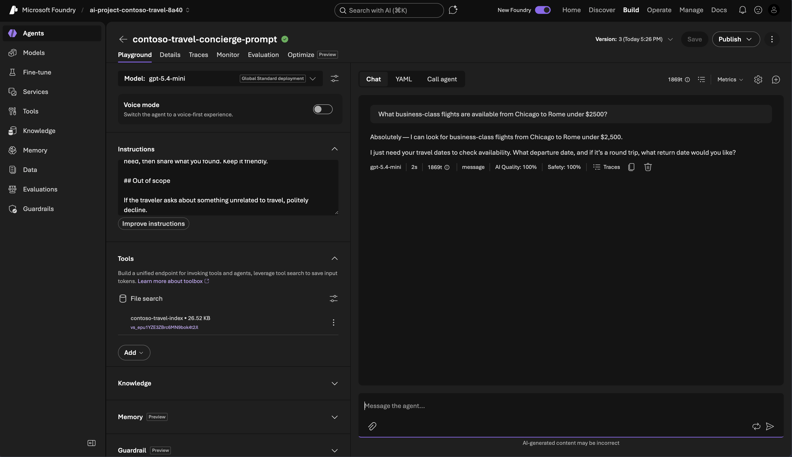

**Turn 2 — give it flexibility.**

Reply with something permissive, e.g.:

> *"Any reasonable travel dates work — pick the cheapest business-class option in the dataset."*

Now the agent has room to move. It should return one or more grounded flight IDs (`CT-FL-...`) with route, price, and cabin, plus follow-up suggestions (dates, hotel, car rental).

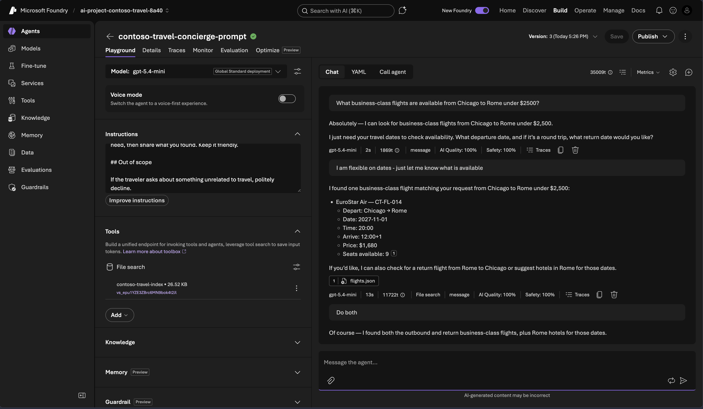

**Turn 3 — extend the request.**

Accept one of the follow-up suggestions, e.g.:

> *"Yes — also find me a Paris hotel for those dates and a return flight."*

The agent should now compose across three retrievals in one response: outbound flight, return flight, and hotel. Citation chips should appear next to each item, pointing back into the JSON index.

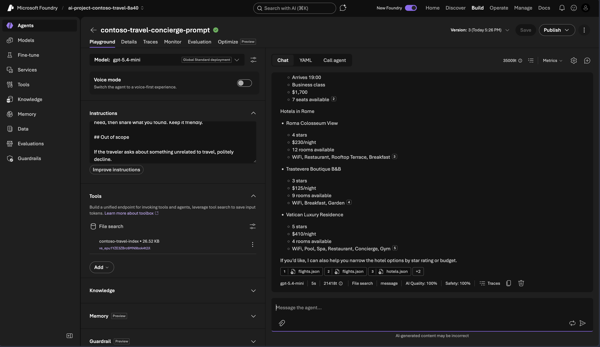

#### What did we learn?

- **The baseline is exactly as weak as advertised.** Turn 1's clarifying question — instead of a grounded list — is the failure mode that will show up on the eval dataset in Core Lab 02. That's *good*: a strong baseline would leave nothing to teach.
- **Grounding survives across turns.** Turns 2 and 3 both cite the JSON index. The retriever isn't stateful, but the model's context carries the earlier answers forward, so citation chains stay coherent across the conversation.
- **Cross-dataset composition works out of the box.** Turn 3 needed flights *and* hotels in the same response. The seed prompt lists all three datasets, and the retriever handles multi-index queries without any additional configuration on our part.
- **This is the green baseline.** Three turns, three behaviors confirmed. Fundamentals is done.

#### Extension

- Ask Copilot: *"Using the microsoft-foundry `deploy` sub-skill, tell me which version of `contoso-travel-concierge-prompt` this three-turn conversation ran against, and show me the exact instructions text that produced turn 1's clarifying question."*
- Ask a variant of the canonical question that stresses a different dataset — for example *"Find me an economy car rental in Paris for next weekend"* — and confirm the agent still cites `car_rentals.json` chunks.
- Copy your project endpoint and the agent name into a scratch note. Core Lab 01 assumes you have both handy for the trace-inspection steps.

#### Tips

- 💡 **Turn 1's clarifying question is a feature, not a bug — at baseline.** Do not "fix" it here. Fixing it is Core Lab 03's job, and doing it now would erase the gap we need to teach optimization.
- 💡 If turn 2 comes back **without citations**, the retriever probably hasn't finished warming — retry the same reply in ~10 seconds. If it still returns no citations, revisit §7.6 step 3 and confirm the index built.
- ⚠️ **Do not** run any of the three turns twice back to back with the same phrasing. The playground caches recent responses aggressively; if the second run looks suspiciously identical to the first, that's the cache, not a real invocation. Change one word to bypass.
- 🔎 **Walkthrough note:** the current [Lab 05 — Smoke-test the Prompt Agent](../fundamentals/05-verify.md) shows only a single-turn canonical question. The devguide extends that to a three-turn conversation because it demonstrates the **v3 weakness → grounded recovery → cross-dataset composition** story that anchors the rest of the workshop.
