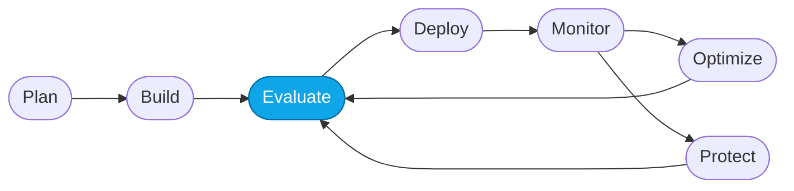
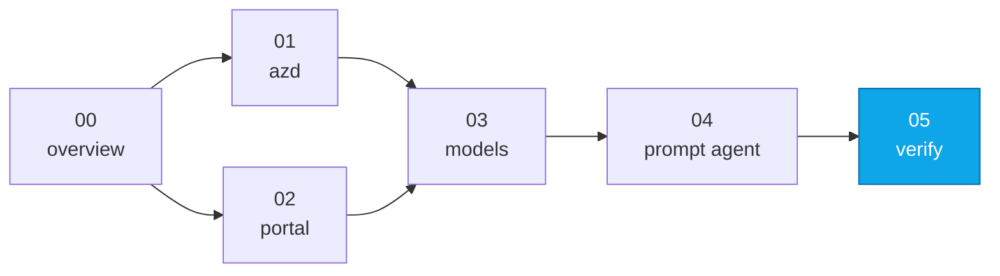

# Lab 05 — Smoke-test the Prompt Agent

> **What you'll do:** Confirm the Prompt Agent answers a canonical question end-to-end before moving into the Core Labs.
> **Time:** ~5 min · **Prerequisites:** [Lab 04](./04-create-prompt-agent.md)

## 🎯 Goal

Prove that everything you set up in Fundamentals is wired correctly — the
Prompt Agent responds to a specific travel question with a **grounded** answer
citations. This is your **green baseline** for the Core Labs.

> 🧭 The Hosted Agent is not built here. You build it from scratch in the
> **[Core Labs Capstone](../core/05-capstone-hosted.md)** using the
> `microsoft-foundry` `create` sub-skill, so this Fundamentals track ends at
> the Prompt Agent.

## 🧭 Where this fits

> 🧭 **This lab covers:** _Evaluate_ (informally) — a smoke check before the
> real evaluation labs.

### 📍 You are here

## The canonical question

> **"What business-class flights are available from Chicago to Rome under
> $2500?"**

This question:

- exercises the flight tool / dataset,
- has an unambiguous answer grounded in `data/flights.csv`,
- and comes up again in Core Lab 02 as an evaluation input.

## 📋 Steps

1. **Ask the Prompt Agent.**
   Portal → **My assets → Agents → `contoso-travel-concierge-prompt` → Try
   in playground** → paste the canonical question.

   Expected: at least one specific flight ID (like `CT-FL-...`) with airline,
   route, and price. If it *asks a clarifying question instead*, that's the
   baseline weakness — still a pass for this lab.

   <!-- TODO(nitya): screenshot of the Prompt Agent playground response -->

2. **Confirm the trace is visible.**
   Expand the trace panel on the right. You should see at least one span for
   the agent turn plus retrieval spans from the `contoso-travel-index`.

3. **Save your notes.**
   Copy the project endpoint and the agent name into your notes. Core Lab 01
   assumes you have them.

## ✅ Verify

- The Prompt Agent returns a grounded answer with flight IDs.
- The playground trace panel shows at least one span for the turn.

If both check out, **Fundamentals is complete**.

## 🧠 Recap

- The Prompt Agent is now wired end-to-end: model → instructions → grounded
  data → traceable response.
- Traces are captured automatically — you'll use them heavily in Core Lab 01.
- The Prompt Agent's under-answer here (over-asking clarifying questions,
  loosely-grounded claims) is the **motivation** for Core Lab 03 (optimization).
- The Hosted Agent is deliberately deferred to the **Core Labs Capstone**,
  where you build it from scratch with the `microsoft-foundry` `create`
  sub-skill against this same Foundry project.

## ➡️ Next

Enter the Core Labs with **[Core Lab 00 — Overview](../core/00-overview.md)**.
